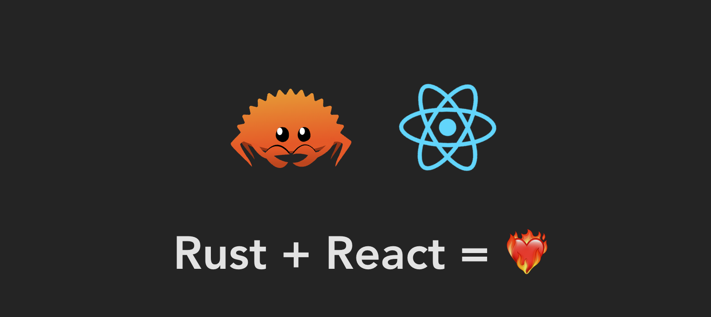

# Rust + React = SSR
Simple example running React in SSR using Rust as a backend

Learn V8 from [here](https://github.com/denoland/rusty_v8/blob/main/examples/hello_world.rs)

## Preparation
- First make sure you install [Rust](https://www.rust-lang.org/)
- And install LLVM & Clang

## How To Run

Before running the server, it required to build the frontend project

```bash
# Go to target directory
cd examples/source

# Install using yarn
yarn 

# Build all required files
yarn build:all

# Back to root project
cd ../../
```

```bash
# serve with actix web server
# Using V8
cargo build --example=actix-v8 --release

# Using JSC
cargo build --example=actix-jsc --release
```

```bash
# Serve the example
# V8
cargo run --example=actix-v8 --release

# JSC
cargo build --example=actix-jsc --release
```

See the serve in : [http://localhost:8088](http://localhost:8088)

## TODO
- [ ] Babel transformer => using same api in Next.js
- [ ] Benchmarking and compare with Next.js
- [ ] Using [JSC](https://github.com/WebKit/WebKit/tree/main/Source/JavaScriptCore)
- [ ] Fix JSC ```[Object Module]```